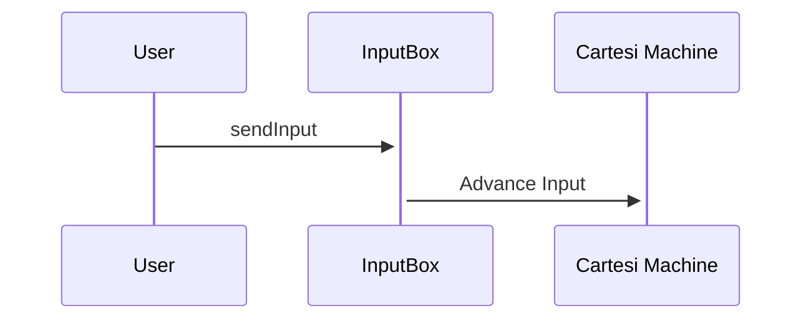
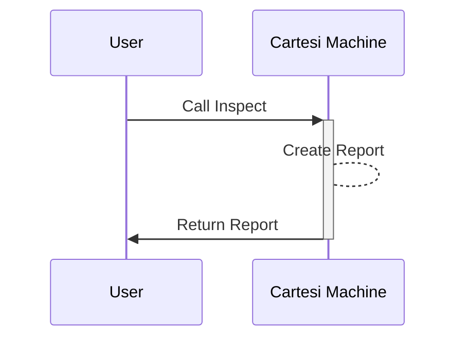
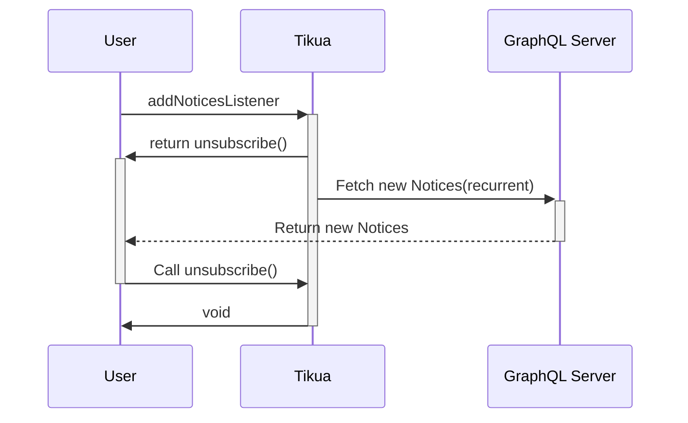
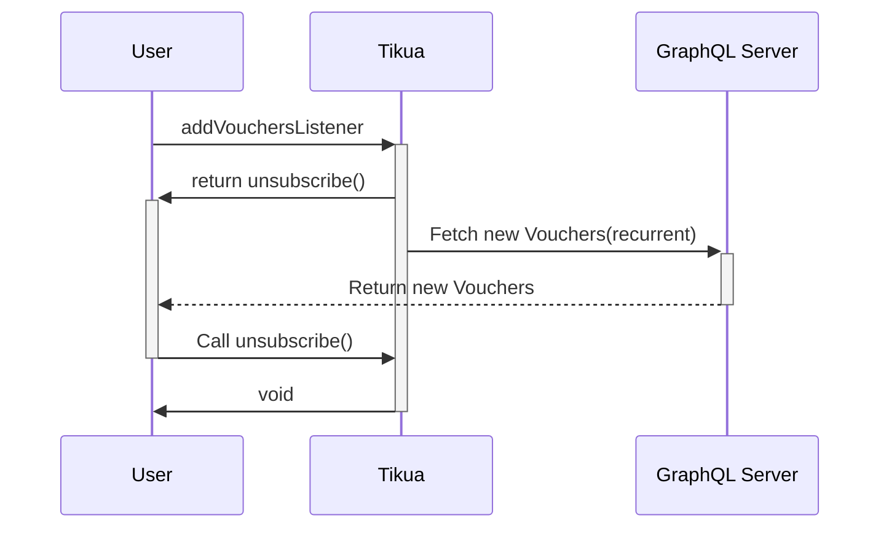
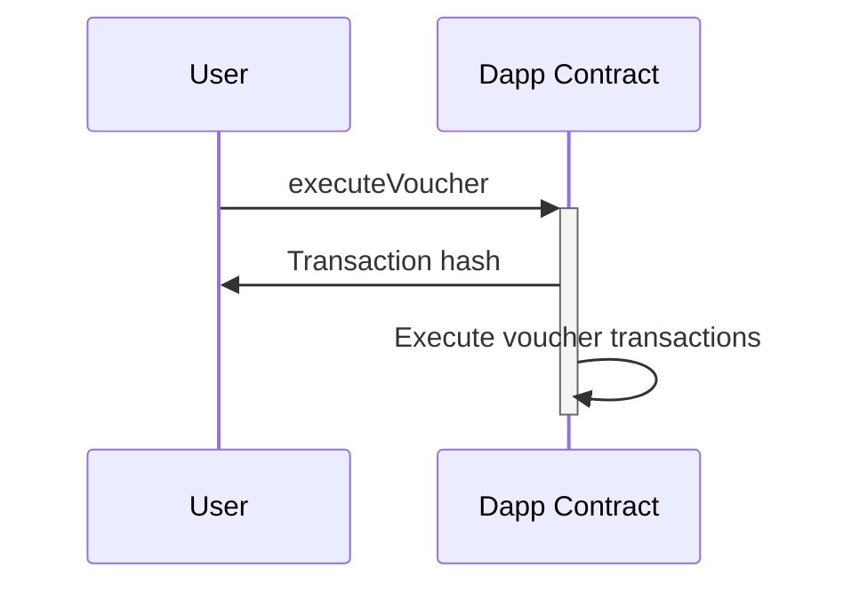
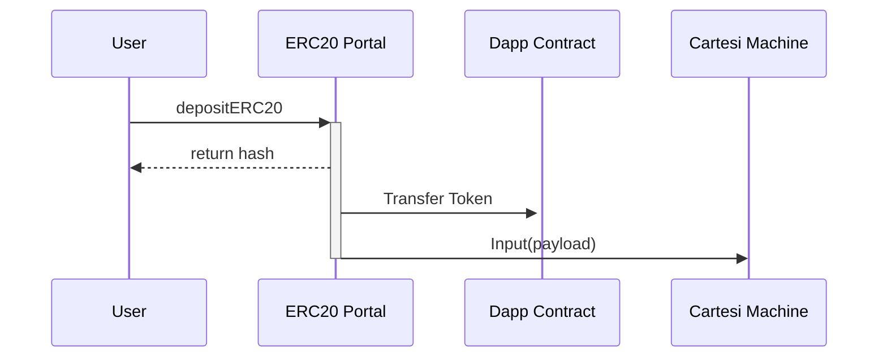
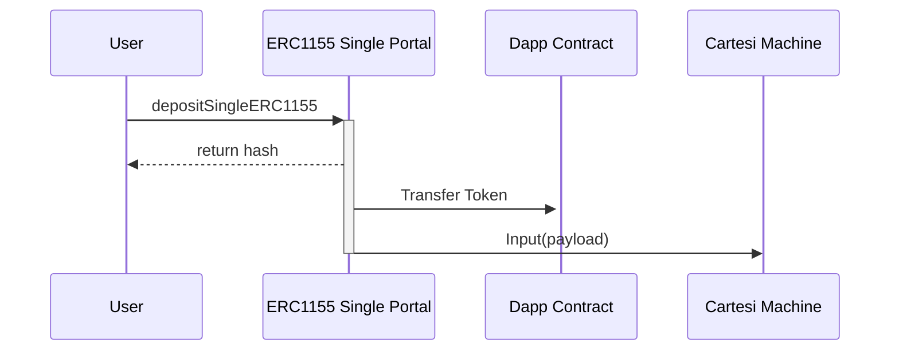
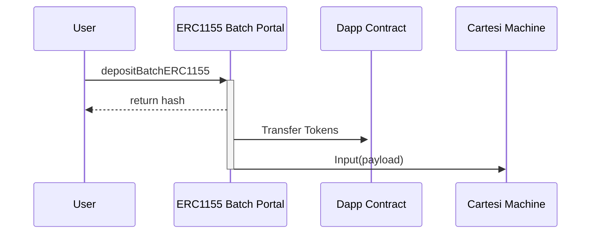

<p align="center">
  <a href="https://github.com/doiim/cartesi-sdk" title="Tikua Cartesi SDK">
    
  </a>
</p>

# Tikua

A Isomorphic JS Cartesi package to use with any visual library on Browser or Terminal. The SDK will support any provider or network. All configurable and allowing defining an app with multiple chains supported. The SDK should adapt accordingly to the configurations and raise warnings in cases of non-supported provider chains.

## Installation

```sh
npm install -s @doiim/tikua
```

## Usage

You can jump directly to our [Examples](https://github.com/doiim/tikua/tree/master/examples) folder and check how to implement Tikua on multiple platforms or check here the description of Tikua Class and its functions.

### Tikua SDK

The `Tikua` class is the main entry point for this SDK. It is instantiated with the following parameters:

- `abi`: The ABI of your dapp. [Human Readable ABI definition](https://abitype.dev/api/human)
- `provider (optional)`: The EIP1193 provider to use. Needed for Input calls.
- `appAddress (optional)`: The address of your application deployed. Needed for Input calls.
- `appEndpoint (optional)`: The endpoint of your dapp. Needed for Inspect and Notices

- `waitBlocks`: The amount of blocks to wait before considering an input sent. Defaults to 1.
- `signerAddress (optional)`: The account to sign transactions. Defaults to the first account returned from `getAddresses()` on the provider.

```ts
const abi = [
  "function attackDragon(uint256 dragonId, string weapon)",
  "function dragonStatus(uint256 dragonId) returns (uint256)",
];
const tikua = new Tikua({
  appAddress: "0x0123123",
  appEndpoint: "https://host.backend/",
  provider,
  abi,
});
```

#### `sendInput`

Send a function input to the Cartesi contract.

- `fn: string`: The name of the function to call.
- `args: any[]`: An array of arguments to pass to the function.

Returns a promise that resolves to the transaction hash of the sent input.

```ts
const txHash = await tikua.sendInput("attackDragon", [1, "sword"]);
```



#### `fetchInspect`

Fetch the inspect data for a transaction ID.

- `id: string`: The ID of the transaction to fetch.
- `args: any[]`: Array of arguments to be passed to function.

```ts
const status = await tikua.fetchInspect("dragonStatus", [dragonId]);
```



Returns a promise that resolves to the inspect data of the transaction.

#### `addNoticesListener`

Listen for all notices triggered by the Cartesi Machine

- `pollInterval: number`: Time between each request to GraphQL.
- `fn: (report: any) => void`: The function to call when a report is received.

```ts
const unsubscribe = await tikua.addNoticesListener(1000, (result) => {
  console.log(result);
});
```



#### `addVouchersListener`

Adds a listener for vouchers, polling for new vouchers at a specified interval and executing a callback function for each new voucher.

- `pollInterval: number`: The interval, in milliseconds, at which to poll for new vouchers.
- `callback: (result: VoucherDecoded[]) => void`: The callback function to execute for each voucher fetched.

Returns a function that can be called to stop listening for vouchers.



#### `checkVoucher`

Checks if a voucher has been executed on the Cartesi DApp. It requires the voucher to have a proof to verify its execution status.

- `voucher: VoucherDecoded`: The voucher object to check, which must include a proof of execution.

Returns a promise that resolves to a boolean indicating whether the voucher has been executed.

#### `fetchVouchersFromInput`

Fetches a voucher from a specific input index and voucher index within the Cartesi DApp.

- `voucher: VoucherDecoded`: The voucher returned from a listener or a fetch.

Returns a promise that resolves to an array of vouchers fetched from the specified input index.

#### `executeVoucher`

Executes a voucher on the Cartesi DApp, simulating the transaction and then writing it to the blockchain if successful. This function is crucial for processing vouchers, which are essentially tasks or commands that have been issued to the DApp.

- `voucher: VoucherDecoded`: The voucher object to be executed. It must include the destination address, the payload data, and the proof of validity.

Returns a promise that resolves to the transaction hash of the executed voucher transaction.

```ts
const voucher = {
  destination: "0x...",
  payload: "...",
  proof: "...",
};
const txHash = await tikua.executeVoucher(voucher);
console.log(txHash);
```



#### `depositEther`

Deposits Ether on the Ether Portal, simulating the deposit transaction and returning the transaction hash.

- `amount: bigint`: The amount of Ether to deposit.
- `execLayerData: string`: The execution layer data for the deposit.

Returns a promise that resolves to the transaction hash of the simulated deposit transaction.

#### `approveERC20`

Approves ERC20 tokens for deposit on the ERC20 Portal, simulating the approval transaction and returning the transaction hash.

- `token: Address`: The address of the ERC20 token to approve.
- `amount: bigint`: The amount of ERC20 tokens to approve.

Returns a promise that resolves to the transaction hash of the simulated approval transaction.

#### `depositERC20`

Deposits ERC20 tokens on the ERC20 Portal, simulating the deposit transaction and returning the transaction hash.

- `token: Address`: The address of the ERC20 token to deposit.
- `amount: bigint`: The amount of ERC20 tokens to deposit.
- `execLayerData: string`: Optional execution layer data for the deposit.

Returns a promise that resolves to the transaction hash of the simulated deposit transaction.



#### `approveERC721`

Approves an ERC721 token for deposit on the ERC721 Portal, simulating the approval transaction and returning the transaction hash.

- `token: Address`: The address of the ERC721 token.
- `tokenId: bigint`: The ID of the ERC721 token to approve.

Returns a promise that resolves to the transaction hash of the simulated approval transaction.

#### `depositERC721`

Deposits an ERC721 token on the ERC721 Portal, simulating the deposit transaction and returning the transaction hash.

- `token: Address`: The address of the ERC721 token to deposit.
- `tokenId: bigint`: The ID of the ERC721 token to deposit.
- `baseLayerData: string`: Optional base layer data for the deposit.
- `execLayerData: string`: Optional execution layer data for the deposit.

Returns a promise that resolves to the transaction hash of the simulated deposit transaction.


#### `approveSingleERC1155`

This function is used to set approval for the ERC1155 Single Portal contract to transfer your tokens.

- `token: Address`: The address of the ERC1155 token.
- `approve: boolean`: Whether to set approval or revoke approval. Default is true (approve).

Returns the transaction hash of the simulated transaction.

```ts
const tokenAddress = "0x1234567890";
const txHash = await tikua.approveSingleERC1155(tokenAddress, true);
```

#### `approveBatchERC1155`

This function is used to approve ERC1155 tokens to be sent to the ERC1155 Batch Portal. It approves the portal to spend all tokens of this type.

- `token: Address`: Address: The address of the ERC1155 token.
- `approve: boolean`: Whether to set approval or revoke approval. Default is true (approve).

Returns the transaction hash of the simulated approval transaction.

```ts
const tokenAddress = "0x1234567890";
const txHash = await tikua.approveBatchERC1155(tokenAddress, true);
```

#### `depositSingleERC1155`

Deposits a single ERC1155 token into the ERC1155 Single Portal. This function prepares and simulates a transaction to deposit a specified amount of a single ERC1155 token. It is designed to interact with the Cartesi infrastructure on a specified blockchain network.

- `token: Address` - The contract address of the ERC1155 token.
- `tokenId: bigint` - The unique identifier (ID) of the ERC1155 token to deposit.
- `amount: bigint` - The quantity of the specified ERC1155 token to deposit.
- `baseLayerData: string` - (Optional) Additional data for the base layer of the deposit transaction. Defaults to an empty string.
- `execLayerData: string` - (Optional) Execution layer data for the deposit transaction. Defaults to an empty string.

Returns `Promise<string>` - A promise that resolves to the transaction hash of the simulated deposit transaction.

```ts
const tokenAddress = "0x...";
const tokenId = BigInt(1);
const amount = BigInt(100);
const baseLayerData = "";
const execLayerData = "";

const txHash = await tikua.depositSingleERC1155(
  tokenAddress,
  tokenId,
  amount,
  baseLayerData,
  execLayerData
);
```



#### `depositBatchERC1155`

Deposits a batch of ERC1155 tokens into the ERC1155 Batch Portal on a specified blockchain network. This function is designed to handle multiple tokens and their respective amounts in a single transaction, streamlining the deposit process for users.

- `token: Address` - The smart contract address of the ERC1155 token.
- `tokenIds: bigint[]` - An array of token IDs. Each ID corresponds to a specific token type within the ERC1155 contract.
- `amounts: bigint[]` - An array of amounts. Each amount corresponds to the quantity of the token type specified by the `tokenIds` array to be deposited. The order of amounts must match the order of `tokenIds`.
- `baseLayerData: string` (Optional) - Additional data that may be required by the base layer of the blockchain. This parameter is optional and can be left empty if not needed.
- `execLayerData: string` (Optional) - Execution layer data that may be required for the deposit transaction. This parameter is optional and can be left empty if not needed.

Returns `Promise<string>` - A promise that resolves to the transaction hash of the deposit operation. This hash can be used to track the transaction on the blockchain.

```ts
const tokenAddress = "0xYourTokenAddressHere";
const tokenIds = [1n, 2n, 3n];
const amounts = [100n, 200n, 300n];
const baseLayerData = "";
const execLayerData = "";

const txHash = await tikua.depositBatchERC1155(
  tokenAddress,
  tokenIds,
  amounts,
  baseLayerData,
  execLayerData
);
```



### Utility Static Functions

#### `getCartesiDeploymentAddress`

Retrieves the deployment address for a given contract on a specified chain.

- `chainId` (number | AddressLike): The ID of the chain or the address of the chain.
- `contract` (ContractName): The name of the contract to retrieve the deployment address for.

Returns the deployment address of the specified contract.

#### `getCartesiContractAbi`

Retrieves the ABI (Application Binary Interface) of a Cartesi contract based on the provided contract name.

- `chainId` (number | Address): The ID or address of the chain to retrieve the contract ABI from.
- `contract` (ContractName): The name of the contract to retrieve the ABI for.

Returns the ABI of the specified Cartesi contract.

#### `decodeEtherDeposit` (For Backend decoding)

Decodes the payload of an Ether deposit transaction into an object containing the deposit details.

- `payload` (\`0x\${string}\`): The payload of the Ether deposit transaction.

Returns an object containing the decoded details of the Ether deposit.

Throws an error if the payload is invalid.

#### `decodeERC20Deposit` (For Backend decoding)

Decodes the payload of an ERC20 deposit transaction into an object containing the deposit details.

- `payload` (\`0x\${string}\`): The payload of the ERC20 deposit transaction.

Returns an object containing the decoded details of the ERC20 deposit.

Throws an error if the payload is invalid or the ERC20 deposit transaction failed.

#### `decodeERC721Deposit` (For Backend decoding)

Decodes the payload of an ERC721 deposit transaction into an object containing the deposit details.

- `payload` (\`0x\${string}\`): The payload of the ERC721 deposit transaction.

Returns an object containing the decoded details of the ERC721 deposit.

Throws an error if the payload is invalid.

#### `decodeERC1155SingleDeposit` (For Backend decoding)

Decodes the payload of an ERC1155 single deposit transaction into an object containing the deposit details.

- `payload` (\`0x\${string}\`): The payload of the ERC1155 single deposit transaction.

Returns an object containing the decoded details of the ERC1155 single deposit.

Throws an error if the payload is invalid.

#### `decodeERC1155BatchDeposit` (For Backend decoding)

Decodes the payload of an ERC1155 batch deposit transaction into an object containing the deposit details.

- `payload` (\`0x\${string}\`): The payload of the ERC1155 batch deposit transaction.

Returns an object containing the decoded details of the ERC1155 batch deposit.

Throws an error if the payload is invalid.

## Backend

For the backend we use a framework call [Deroll](https://github.com/tuler/deroll). It uses a Typescript backend structure centralized in an ABI protocol same way Tikua. You can start from an example implementation on our [Examples](https://github.com/doiim/tikua/tree/master/examples) folder. There you will find a project using Deroll framework to talk with a frontend using Tikua. Deroll uses ABI for encode and decode function calls/responses, accelerating your development in multiple aspects. Both Deroll and Tikua are based on [Viem](https://viem.sh/) library for encode and decode ABI calls.

## References

[Human Readable ABI definition](https://abitype.dev/api/human)
[Viem library](https://viem.sh/)

## For Maintainers

To deploy a new version use:

```sh
npm run build
npm publish
```

To deploy a local version for tests use:

```sh
npm run build
npm pack
```
